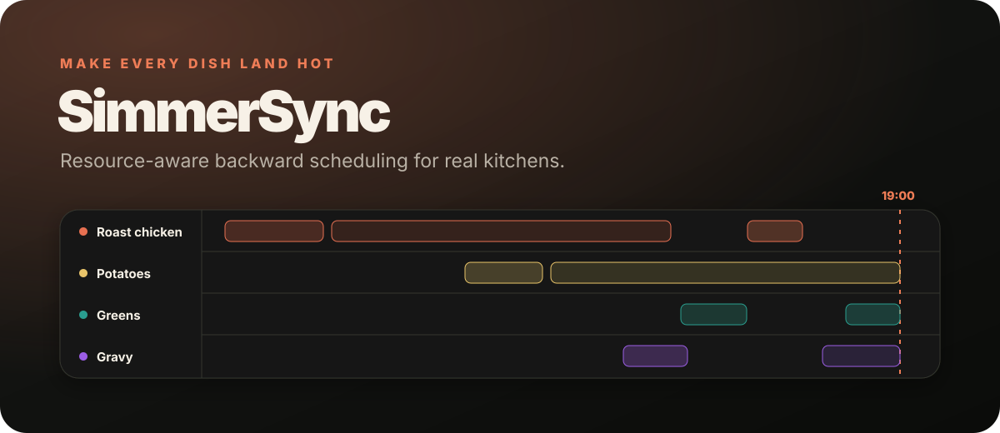

<p align="center">
  
</p>

<p align="center">
  <a href="https://github.com/KanadeK/simmersync/actions/workflows/ci.yml"></a>
  <a href="https://github.com/KanadeK/simmersync/releases/latest"></a>
  <a href="LICENSE"></a>
  
</p>

<p align="center"><strong>Make every dish land hot.</strong></p>

SimmerSync is a local-first scheduling engine for the difficult part of cooking: getting several
dishes ready together with one cook, a limited number of burners, and a finite oven.

Give it a target serve time and a small YAML plan. It schedules backwards, respects dependencies
and resource capacities, then produces a terminal timeline, JSON, CSV, calendar reminders, and a
polished offline Cook Mode.

[简体中文](README.zh-CN.md)

## Why

Recipe managers answer *what to cook*. Timers answer *how long remains*. SimmerSync answers:

> When should I start every step so the chicken, potatoes, greens, and gravy finish together
> without asking me to chop and whisk at the same time?

This is a focused coordination layer, not another recipe database. The rationale and current
competitor review are documented in [the landscape report](docs/landscape.md).

## Try it in two minutes

Install the verified GitHub Release:

```bash
npm install --global \
  https://github.com/KanadeK/simmersync/releases/download/v0.1.0/simmersync-0.1.0.tgz
```

Download an [example plan](examples/sunday-roast.yaml), then run:

```bash
simmersync validate sunday-roast.yaml
simmersync plan sunday-roast.yaml \
  --serve-at "2026-07-28T19:00:00+01:00" \
  --out sunday-roast-plan
```

The command writes:

| Artifact | Use |
| --- | --- |
| `cook-mode.html` | Open locally for a live countdown, now/next state, and persistent checklist |
| `schedule.ics` | Import active-step reminders into a calendar |
| `schedule.json` | Integrate the deterministic plan into another app |
| `schedule.csv` | Inspect or adapt the plan in a spreadsheet |
| `summary.txt` | Print or keep beside the stove |

No file is uploaded. Cook Mode contains no remote script, font, image, or API call.

<details>
<summary>Run directly from source</summary>

```bash
git clone https://github.com/KanadeK/simmersync.git
cd simmersync
npm ci
npm run build
node dist/cli.js plan examples/sunday-roast.yaml \
  --serve-at "2026-07-28T19:00:00+01:00"
```

</details>

## A real resource-aware plan

```yaml
version: 1
title: Dinner for four
timezone: Europe/London

resources:
  cook: { capacity: 1, label: Cook attention }
  oven: { capacity: 2, label: Oven shelves }
  burner: { capacity: 2, label: Hob burners }

defaults:
  attentionResource: cook
  horizonMinutes: 240

dishes:
  - id: roast
    name: Roast chicken
    maxHold: 20
    steps:
      - id: season
        name: Season the chicken
        duration: 10
        mode: active
      - id: bake
        name: Roast
        duration: 55
        mode: passive
        resources: { oven: 1 }
```

Active work automatically consumes `cook`. Passive work can overlap, but only while declared
resources have room. Every dish is an implicit sequence; `after` can add cross-dish dependencies.
See the full [plan format](docs/plan-format.md) and
[JSON Schema](schema/simmersync.schema.json).

## What the engine guarantees

- Every emitted dependency finishes before its dependent step starts.
- No emitted interval exceeds a resource's declared capacity.
- No dish finishes after its requested service offset.
- The same valid input, target time, version, and options produce the same schedule.
- Invalid input and infeasible schedules use different exit codes and actionable diagnostics.

The v0.1 scheduler is a transparent latest-fit heuristic, not a global mathematical optimizer.
Its priorities, complexity, and limitations are documented in
[the algorithm note](docs/algorithm.md).

## CLI

```text
simmersync validate <plan.yaml> [--json]
simmersync plan <plan.yaml> --serve-at <ISO-8601> [options]
simmersync plan <plan.yaml> --serve-in <minutes> [options]
```

Useful options:

- `--out <dir>` selects the artifact directory.
- `--horizon <minutes>` lets prep begin farther before service.
- `--no-write` prints without creating files.
- `--json` prints the machine-readable schedule.
- `--quiet` writes files without terminal output.

Exit codes are `0` success, `1` unexpected failure, `2` invalid input, and `3` infeasible schedule.
The [repair loop](docs/troubleshooting.md) explains what to change after every failure type.

## Reproduce the release gates

```bash
npm ci
npm run check
npm run benchmark
npm run release:build
npm run release:verify
```

`npm run check` runs lint, formatting, strict type checking, coverage thresholds, build, CLI
acceptance tests, and an intentional failure case. Release verification checks every SHA-256,
installs the packed tarball into a clean temporary project, and runs the installed binary.

## Design boundaries

- Local files only; no account, backend, telemetry, or AI service.
- No recipe scraping or copyrighted recipe bundle.
- No nutrition, allergen, or food-safety judgment.
- Node.js 20 or newer; one runtime dependency (`yaml`).
- Minute-level deterministic scheduling in v0.1.

Read [security and privacy](docs/security-and-privacy.md) before integrating untrusted plans.

## Roadmap

The next useful additions are a Cooklang adapter, optional hard freshness windows, collaborative
cook assignment, and an exact-solver comparison mode. See [ROADMAP.md](ROADMAP.md); scope stays
centered on execution-time coordination.

## Contributing

Small reproducible plans are especially valuable. Read [CONTRIBUTING.md](CONTRIBUTING.md), run
`npm run check`, and include the smallest YAML that proves a scheduling problem.

MIT © 2026 [KanadeK](https://github.com/KanadeK)
